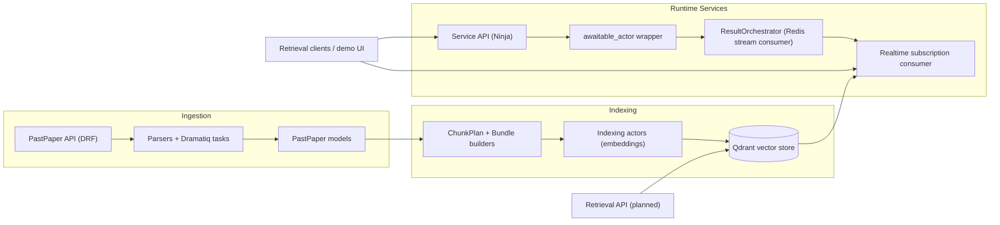

# PastPaperRank Backend Logical Structure

This note captures the major Django backend components and how responsibilities are divided across the project.

## Hierarchical Overview

```mermaid
mindmap
  root(("PastPaperRank Backend"))
    "Config & Boot"
      "settings.py (Django core, Dramatiq, Redis, Qdrant config)"
      "urls.py (route table for APIs and docs)"
      "asgi.py / wsgi.py (server entrypoints)"
    "Domain Apps"
      "pastpaper"
        "models.py (metadata, assets, versioned component tree)"
        "api (DRF endpoints for ingest and management)"
        "parsers (PDF parsing and tree building pipeline)"
        "tasks.py (Dramatiq jobs that drive parsing lifecycle)"
      "indexing"
        "models.py (IndexProfile, ChunkPlan, Bundle, Chunk)"
        "chunker.py / bundler.py (sectioning and chunk generation)"
        "embedding.py / qdrant.py (encoder wiring and vector store client)"
        "api (manage profiles, plans, and indexing status)"
        "tasks.py (plan orchestration, embedding actors)"
      "service"
        "api.py (Ninja API for embeddings and test utilities)"
        "tasks.py (awaitable embedding actor using HF models)"
        "orchestrators (Redis stream bridge for Dramatiq results)"
        "realtime (Channels auth, replay, websocket consumer)"
        "ioqueue (task submission helpers)"
      "retrieval"
        "views.py (demo page renderer)"
        "consumer.py / tasks.py (demo retrieval workflow)"
    "Shared & Ops"
      "utils (memory monitor)"
      "tests (integration and unit coverage)"
      "deploy (Docker image, supervisor, health checks)"
      "templates / media (served assets during development)"
```

## Data and Control Flow



### Key Links

- Parsing jobs turn uploaded assets into `PastPaper` trees that feed ChunkPlans.
- Indexing tasks embed chunk text with Hugging Face models and persist vectors in Qdrant.
- The awaitable Dramatiq actors publish results back through Redis streams so HTTP and websocket clients can await task completion without busy polling.
- Realtime consumers replay progress events to connected clients, supporting interactive demos.

## Feature Spotlight – Comprehensive Past Paper Search

- **Curated corpus (`backend/apps/pastpaper`)**  
  `PastPaperMetadata`, `PastPaper`, and `PastPaperComponent` persist exam-board specific hierarchies, making it possible to answer precise lookups such as `2024 CIE IGCSE 0580 March Paper 1 Q2(b)`. REST endpoints under `backend/apps/pastpaper/api` expose filters by year, board, paper type, and syllabus code so the dataset stays aligned with current specifications. Dramatiq jobs in `tasks.py` keep the database synchronized by parsing new PDF assets into structured component trees.
- **Semantic index (`backend/apps/indexing`)**  
  Index Profiles define encoder + chunking policies, and Chunk Plans orchestrate how each past paper version is tokenized (`chunker.py`, `bundler.py`) and embedded (`embedding.py`, `tasks.py`). Processed chunks are stored in Qdrant with metadata keys (paper id, component path, syllabus tags) that power fuzzy keyword search and semantic retrieval. Activating different plans lets the service tune relevance for various syllabuses without re-uploading content.
- **Search synthesis**  
  When a user issues a query, the active Index Profile is selected to embed the question, execute a vector search in Qdrant, and trace results back to `PastPaperComponent` records. This flow enables both exact question targeting and exploratory keyword search while staying in sync with syllabus updates.
